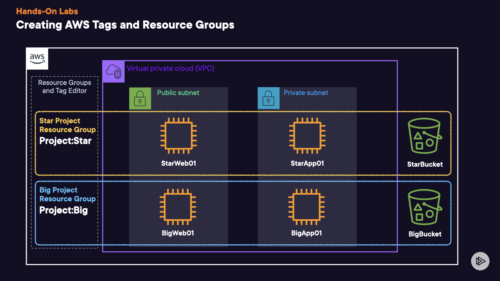

## Using AWS Tags and Resource Groups

### Create and Assign Project-Level Tags to Resources

#### Review the Pre-configured Resources

1. In a new browser tab, navigate to **EC2** > **Instances** (**running**).
2. Select any of the instances listed.
3. In the search bar, enter _S3_, and open it in a new tab. Create two buckets with **small_bucket** and **big_bucket** in the names.

### Module 1 Tagging

1. In a new browser tab, navigate to **Resource Groups & Tag Editor**.
2. Click **Tag Editor** in the left-hand menu.
3. In the **Find resources to tag** section, set the following values:
   - **Regions**: Select **us-east-1**. (It should already be selected.)
   - **Resource types**:
     - Enter and select **AWS::EC2::Instance**.
     - Enter and select **AWS::S3::Bucket**.
4. Click **Search resources**.
5. In the **Resource search results** section, set the following values:
   - In the **Filter resources** search window, enter _star_, and press **Enter** to execute the search.
   - Select **all** the resources, and click **Clear filters**.
6. Click **Manage tags of selected resources**.
7. In the **Edit tags of all selected resources** section, click **Add tag**, and set the following values:
   - **Tag key**: Enter _Project_.
   - **Tag value**: Enter _Small_.
8. Click **Review and apply tag changes** > **Apply changes to all selected**.
9. Navigate to the S3 browser tab, click on the **small_bucket** bucket > **Properties** tab.
10. Scroll down to **Tags**, and you should see **Project** under Key, with **Small** as the **Value**.

## Module 2 Tagging

1. Navigate back to the Resource Groups Management browser tab.
2. With the same Region and resource types selected from the previous step, click **Search resources** again.
3. In the **Resource search results** section, set the following values:
   - In the **Filter resources** search window, enter _big_, and press **Enter**.
   - Select **all** of the instances.
4. Click **Manage tags of selected resources**.
5. In the **Edit tags of all selected resources** section, click **Add tag**, and set the following values:
   - **Tag key**: Enter _Project_.
   - **Tag value**: Enter _Big_.
6. Click **Review and apply tag changes** > **Apply changes to all selected**.

## Create Resource Groups from the Assigned Tags

### Create the `Big-Project-Resource-Group` Resource Group

1. In the left-hand menu, select **Create Resource Group**.
2. For **Group type**, select **Tag based**.
3. In the **Grouping criteria** section, **All supported resource types** should already be selected.
4. In the **Tags** field, select the following:
   - **Tag key**: Select **Project**.
   - **Optional tag value**: Select **Big**.
5. Click **Preview group resources**.
6. Ensure the three group resources show up in the **Group resources** section.
7. In the **Group details** section, enter a **Group name** of _Big-Project-Resource-Group_.
8. Click **Create group**.

## Create the Small-Project-Resource-Group Resource Group

1. In the left-hand menu, click **Create Resource Group**.
2. For **Group type**, select **Tag based**.
3. In the **Grouping criteria** section, **All supported resource types** should still be selected.
4. In the **Tags** field, select the following:
   - **Tag key**: Select **Project**.
   - **Optional tag value**: Select **Small**.
5. Click **Preview group resources**.
6. Ensure the three group resources show up in the **Group resources** section.
7. In the **Group details** section, enter a **Group name** of _Small-Project-Resource-Group_.
8. Click **Create group**.

## View the Saved Resource Groups

1. In the left-hand menu, click **Saved Resource Groups**.
2. Click **Big-Project-Resource-Group**.
   - Here, you should see all the resources in your `Big-Project-Resource-Group` group.

## Test Resource Groups through AWS CloudWatch

1. In a new browser tab, navigate to **CloudWatch**.
2. Under **Overview**, click on the **Filter by resource group** dropdown menu and select either the **Big-Project-Resource-Group** or the **Small-Project-Resource-Group**.
3. Review the resource-group-level statistics.
